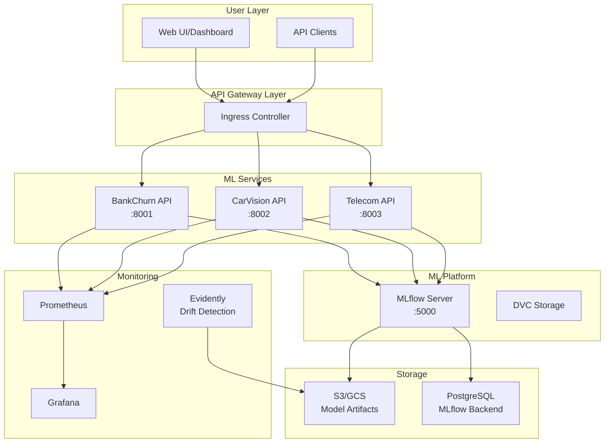
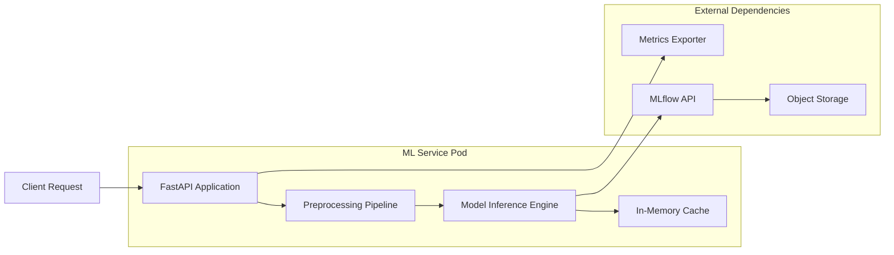
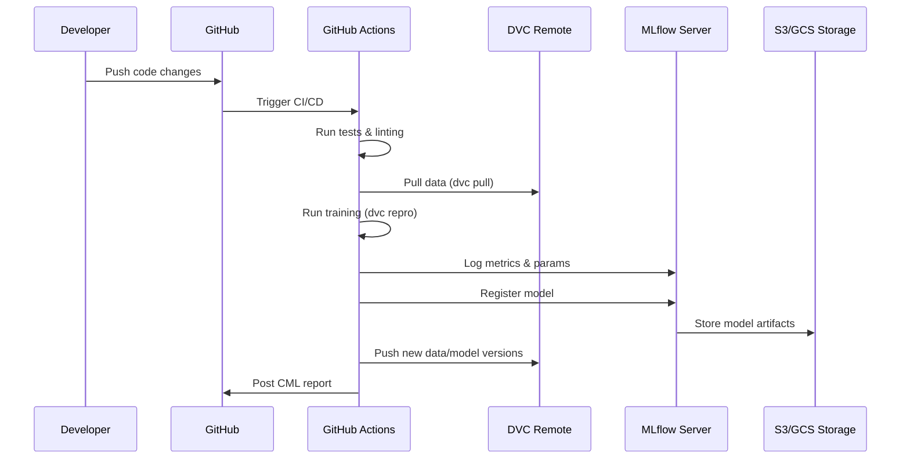
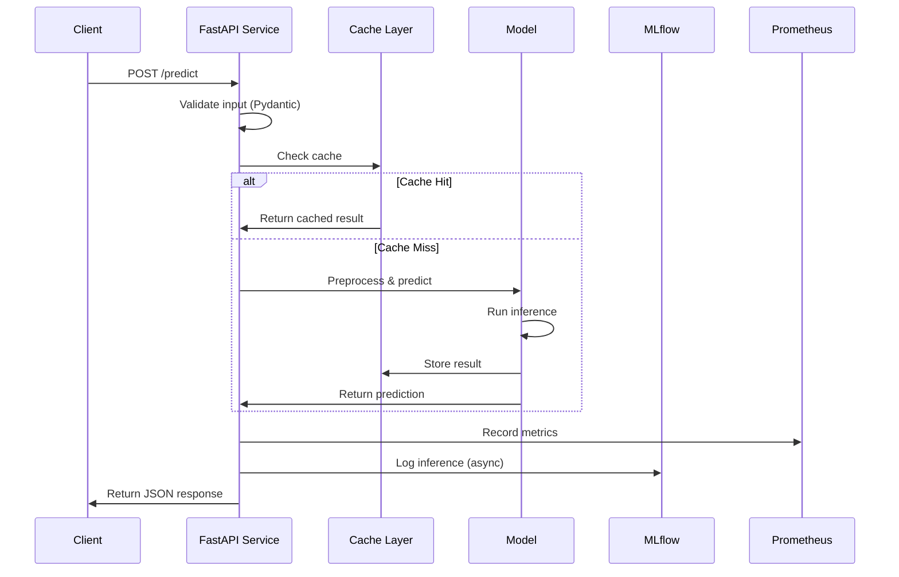
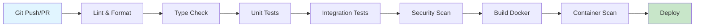
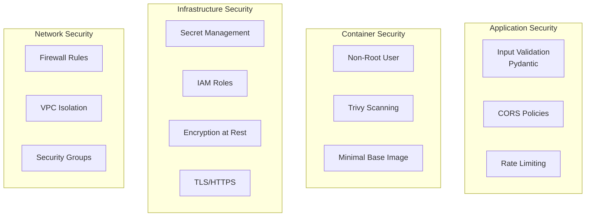
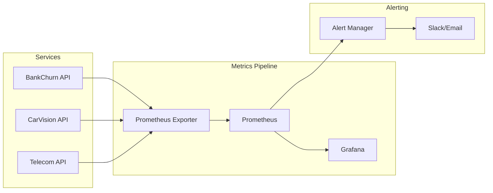
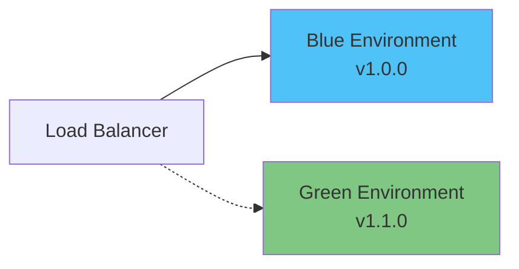
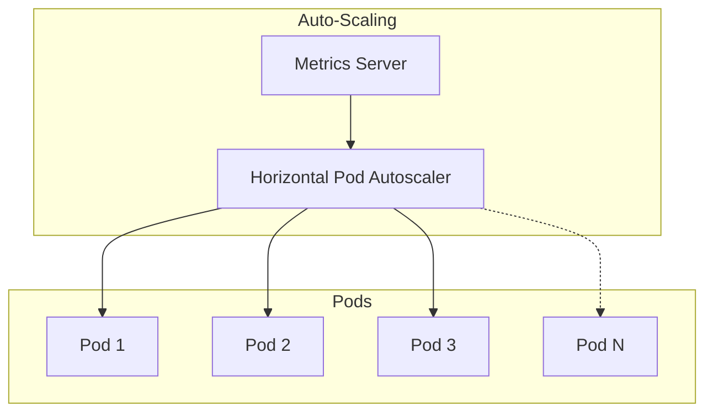

# 🏗️ System Architecture - ML-MLOps Portfolio

## Overview

This document describes the technical architecture of the ML-MLOps Portfolio, a production-ready machine learning platform demonstrating enterprise-grade ML engineering practices.

## Table of Contents
- [High-Level Architecture](#high-level-architecture)
- [Component Architecture](#component-architecture)
- [Data Flow](#data-flow)
- [Infrastructure](#infrastructure)
- [CI/CD Pipeline](#cicd-pipeline)
- [Security Architecture](#security-architecture)
- [Monitoring & Observability](#monitoring--observability)
- [Technology Stack](#technology-stack)

---

## High-Level Architecture



---

## Component Architecture

### ML Services Architecture

Each ML service follows a consistent pattern:



**Components:**
- **FastAPI Application**: REST API endpoints with Pydantic validation
- **Model Inference Engine**: scikit-learn/custom models loaded from MLflow
- **Preprocessing Pipeline**: Feature engineering and transformations
- **In-Memory Cache**: LRU cache for repeated predictions
- **Metrics Exporter**: Prometheus metrics for monitoring

---

## Data Flow

### Training Pipeline



### Inference Pipeline



---

## Infrastructure

### Kubernetes Deployment

```yaml
# Simplified K8s architecture
apiVersion: apps/v1
kind: Deployment
metadata:
  name: bankchurn-predictor
spec:
  replicas: 3
  selector:
    matchLabels:
      app: bankchurn
  template:
    spec:
      containers:
      - name: bankchurn-api
        image: ghcr.io/duqueom/bankchurn:latest
        resources:
          requests:
            memory: "256Mi"
            cpu: "250m"
          limits:
            memory: "512Mi"
            cpu: "500m"
        livenessProbe:
          httpGet:
            path: /health
            port: 8000
        readinessProbe:
          httpGet:
            path: /health
            port: 8000
```

### Terraform Infrastructure

**AWS Resources:**
- EKS Cluster (Kubernetes)
- S3 Buckets (model artifacts, MLflow)
- RDS PostgreSQL (MLflow backend)
- ECR Repositories (Docker images)
- CloudWatch (logging)

**GCP Resources:**
- GKE Cluster
- Cloud Storage (artifacts)
- Cloud SQL (PostgreSQL)
- Artifact Registry
- Cloud Monitoring

---

## CI/CD Pipeline

### Pipeline Stages



**Pipeline Jobs:**

1. **Code Quality**
   - Black formatting
   - isort imports
   - flake8 linting
   - mypy type checking
   - bandit security

2. **Testing**
   - Unit tests (pytest)
   - Integration tests
   - Coverage report (>65% threshold)
   - E2E tests

3. **Container Security**
   - Docker build (multi-stage)
   - Trivy vulnerability scan
   - Image size optimization
   - Non-root user enforcement

4. **Deployment**
   - Push to GHCR/ECR
   - Update K8s manifests
   - Rolling update
   - Health check verification

---

## Security Architecture

### Security Layers



**Security Practices:**

1. **Secrets Management**
   - GitHub Secrets for CI/CD
   - AWS Secrets Manager / GCP Secret Manager
   - No hardcoded credentials

2. **Container Security**
   - Multi-stage builds
   - Non-root user (UID 1000)
   - Read-only root filesystem
   - Trivy scanning in CI

3. **API Security**
   - Input validation (Pydantic)
   - Rate limiting
   - CORS configuration
   - API key authentication (optional)

4. **Infrastructure Security**
   - VPC isolation
   - Private subnets for databases
   - Security groups
   - Encryption at rest (S3, RDS)

---

## Monitoring & Observability

### Metrics Collection



**Monitored Metrics:**

1. **System Metrics**
   - CPU/Memory usage
   - Request latency (p50, p95, p99)
   - Request rate (RPS)
   - Error rate

2. **ML Metrics**
   - Prediction latency
   - Model version in use
   - Feature statistics
   - Prediction distribution

3. **Business Metrics**
   - Predictions per day
   - API usage by endpoint
   - User patterns

### Drift Detection

**Evidently Integration:**
- Scheduled daily checks (2 AM UTC)
- Compares reference vs current data
- Generates HTML reports
- Creates GitHub issues on drift alert
- Tracks feature drift over time

---

## Technology Stack

### Core Technologies

| Layer | Technology | Purpose |
|-------|-----------|---------|
| **Language** | Python 3.12 | Main development language |
| **ML Framework** | scikit-learn, imbalanced-learn | Model training |
| **API Framework** | FastAPI, Uvicorn | REST API services |
| **Validation** | Pydantic | Data validation |
| **Containerization** | Docker (multi-stage) | Application packaging |
| **Orchestration** | Kubernetes | Container orchestration |
| **ML Tracking** | MLflow | Experiment tracking |
| **Data Versioning** | DVC | Data/model versioning |
| **IaC** | Terraform | Infrastructure as code |
| **CI/CD** | GitHub Actions | Automation pipeline |
| **Monitoring** | Prometheus + Grafana | Observability |
| **Drift Detection** | Evidently | Data drift monitoring |

### Development Tools

- **Linting**: black, isort, flake8
- **Type Checking**: mypy
- **Testing**: pytest, pytest-cov
- **Security**: bandit, trivy
- **Pre-commit**: Automated checks

---

## Deployment Patterns

### Blue-Green Deployment



**Process:**
1. Deploy new version (green) alongside old (blue)
2. Run smoke tests on green
3. Gradually shift traffic: 10% → 50% → 100%
4. Monitor metrics during transition
5. Rollback to blue if issues detected
6. Decommission blue after validation

---

## Scaling Strategy

### Horizontal Scaling



**Scaling Rules:**
- CPU > 70%: Scale up
- Memory > 80%: Scale up
- Request latency > 500ms: Scale up
- Min replicas: 2
- Max replicas: 10

---

## Disaster Recovery

**Backup Strategy:**
- **Models**: Versioned in S3/GCS with lifecycle policies
- **Data**: DVC remote storage with versioning
- **Database**: Daily automated backups (7-day retention)
- **Config**: GitOps (version controlled)

**Recovery Time Objectives (RTO):**
- Service restoration: < 15 minutes
- Data restoration: < 1 hour
- Full system restoration: < 4 hours

---

## Future Enhancements

1. **Feature Store** (Feast)
   - Centralized feature management
   - Online/offline serving
   - Feature freshness monitoring

2. **A/B Testing Framework**
   - Multi-armed bandit algorithms
   - Traffic splitting
   - Statistical significance testing

3. **Model Explainability**
   - SHAP values
   - LIME explanations
   - Feature importance dashboard

4. **Advanced Monitoring**
   - Distributed tracing (Jaeger)
   - APM (Application Performance Monitoring)
   - Log aggregation (ELK stack)

---

## References

- [MLflow Documentation](https://mlflow.org/docs/latest/index.html)
- [DVC Documentation](https://dvc.org/doc)
- [Evidently Documentation](https://docs.evidentlyai.com/)
- [Kubernetes Best Practices](https://kubernetes.io/docs/concepts/configuration/overview/)
- [Terraform AWS Provider](https://registry.terraform.io/providers/hashicorp/aws/latest/docs)

---

**Document Version:** 1.0.0  
**Last Updated:** November 2024  
**Maintained by:** DuqueOM
